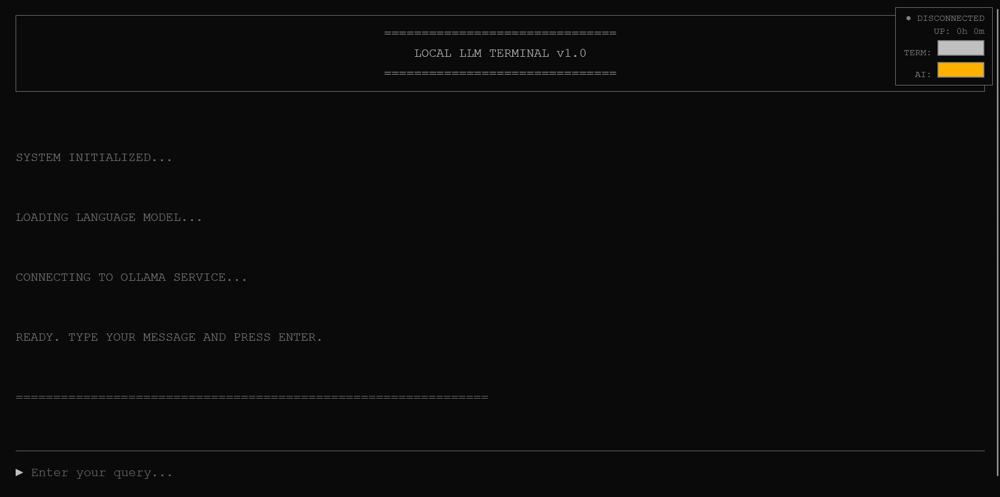

# Retro Local LLM Terminal

A retro terminal-style web interface for interacting with local LLMs via Ollama.



## Features

- Clean, minimal terminal aesthetic
- Customizable text colors (terminal and AI response colors)
- Typing animation for AI responses
- Auto-detects available Ollama models
- Session uptime display
- Responsive design

## Prerequisites

- [Ollama](https://ollama.com/) installed and running
- A compatible LLM model (tinyllama, gemma, phi, etc.)
- Python 3 (for local web server)

## Installation

1. **Clone this repository:**
```bash
   git clone https://github.com/YeretteXYZ/retro-llm-terminal.git
   cd retro-llm-terminal
```

2. **Install and configure Ollama:**
```bash
   curl -fsSL https://ollama.com/install.sh | sh
   ollama pull tinyllama
   sudo systemctl edit ollama
```
   
   Add these lines:
```
   [Service]
   Environment="OLLAMA_HOST=0.0.0.0:11434"
   Environment="OLLAMA_ORIGINS=*"
```
   
   Restart Ollama:
```bash
   sudo systemctl daemon-reload
   sudo systemctl restart ollama
```

3. **Start the web server:**
```bash
   python3 -m http.server 8080
```

4. **Open in your browser:**
```
   http://localhost:8080
```

## Configuration

The terminal auto-detects your installed Ollama models and uses the first available model by default.

### Customizing Colors

Use the color pickers in the top-right corner:
- **TERM:** Terminal text color
- **AI:** AI response color

Colors are saved in your browser's local storage.

### System Prompt

To modify response behavior, edit the `system` parameter in `index.html`:
```javascript
system: "You are a helpful AI assistant. Keep all responses under 3 sentences and be concise."
```

## Remote Access

To access from other devices on your network:
```
http://YOUR_IP:8080
```

## Support

If you find this useful, consider [supporting development](https://app.paymento.io/payment-link/3a5de61d292149b894cc0d1565063657).

## License

MIT

## Credits

Built for use with [Ollama](https://ollama.com/)
